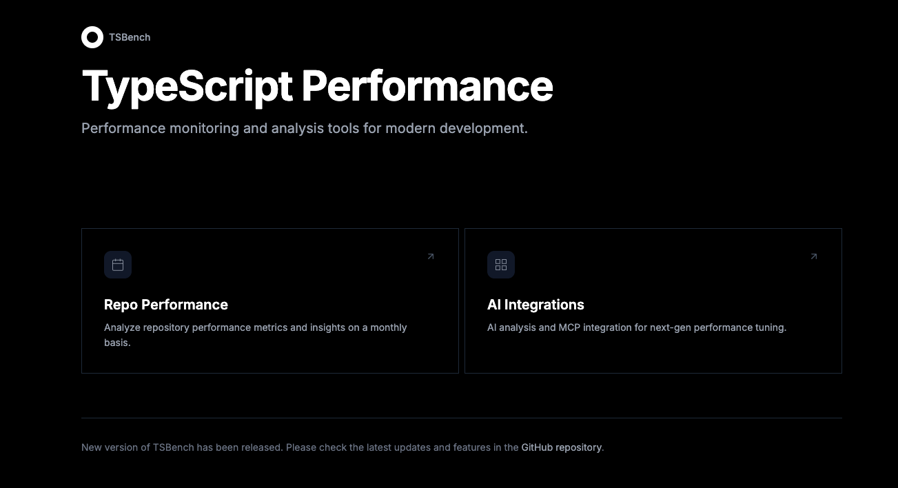
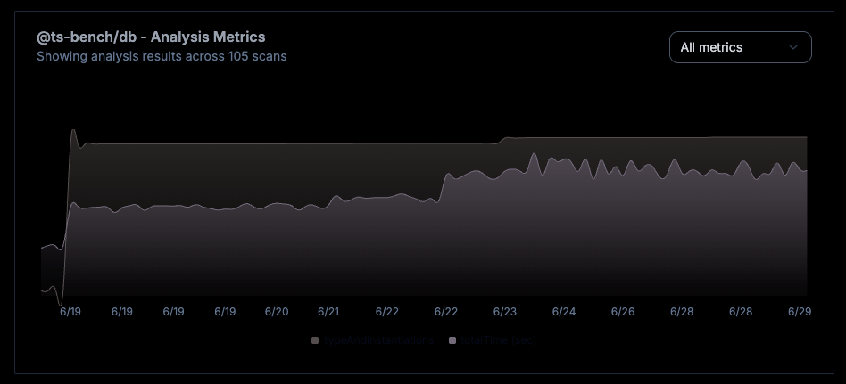
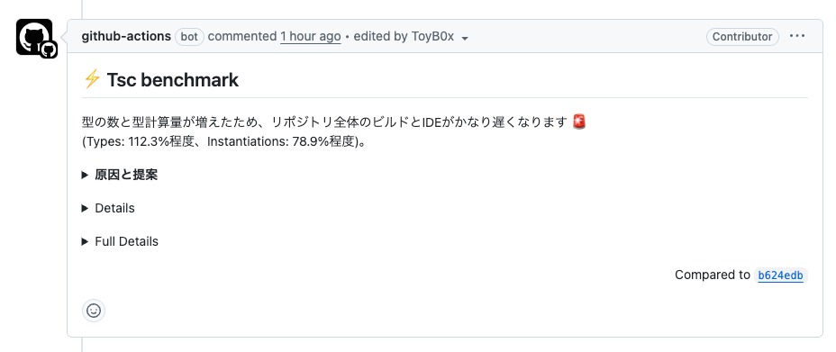

# TS Bench
**AI-powered TypeScript performance monitoring and optimization platform**

# Core Concepts

🚀 **Performance Intelligence**: Monitor compilation times, type inference overhead, and IDE responsiveness with precision metrics

🤖 **AI-Driven Optimization**: Get intelligent performance improvement suggestions powered by advanced analysis

⚡ **Automated Workflows**: Streamline optimization with MCP (Model Context Protocol) and Claude Actions for seamless AI integration

# Overview

<div align="center">
  
  
  
</div>

# Motivation
- Feature to measure IDE comfort and type inference load using TSC command (There is a strong correlation between the TSC command and IDE IntelliSense functionality)

# Features

- Summarize the results of the analysis
- AI comment feature to provide insights and suggestions based on the analysis results
  - AI comment also recorded in the database, so you can check the history of the AI comment (with graph)

# Usage
```bash
npx @ts-bench/cli
```

# Roadmap
- Graph display of report results for monitoring
- Creation of MCP
  - Provide description of refactoring policies
  - Provide measurement tools

# TODO: high priority
- 🚧🔨⏳ Implement features to rapid scan
  - limit the packages (this is useful for large monorepos, but difficult to analyze if type dependent package build is needed, also but, turborepo can help build cache)
    - specify the paths to scan directory
    - specify the package names to scan
- 🚧🔨⏳ Add Human(or AI) readable / and "Actionable" report (including hotspots summary)
  - Provide a way to generate a report that is easy to understand and actionable
  - Provide a way to generate a report that can be used for code review
  - Provide report for LLM First 
- 🚧🔨⏳ Add MCP
  - Add MCP to find .ts / .ts file that import specific package (find positive reason for split export / import)
  - Add MCP to find .ts / .ts file that does not generate .d.ts file (find positive reason for not generating .d.ts file and import them)

# TODO: mid-priority
- Implement features to bulk scan
  - specify the time range for the scan (e.g., last 24 hours, last week, last months)
  - specify the skip span (e.g., skip each odd commit, skip each even commit, skip every 10th commit, scan only 1st each day, scan only 1st commit each week etc.)
- Speed up analyze
  - Use turbo cache to speed up the analysis
  - Consider using custom dependency resolution to utilize cache for other ecosystems (e.g., pnpm, yarn, etc.), of self implemented dependency resolution, cache system.
  - If using turbo, is it much easier than the above? (But is it difficult to sync with the target repository?)

# TODO: low priority
- refactor database table models (decrease size, remove unused fields, etc.)
- Add dark mode support
- Add E2E tests
- Add Graph / Split Graph recent 10, recent 1year (or drill down to specific range)
- Add ability to show report web site without self-hosting (mostly large monorepos are belonging to companies with private repo, so it is a little bit difficult to self-host the report site with github-pages and so on)
- Notification 
  - Add notification feature to notify when the metrics are deteriorated (e.g., Slack notification)
- Documentation
  - Provide documentation for each metric
  - Provide metrics that are recommended to prioritize (stability, correlation with IDE load, correlation with build time monitoring)
  - Provide instructions on how to run locally (including db init, etc.)
- git depth check on bulk scan
  - Add a feature to check the git depth of the repository before running the bulk scan
  - If the git depth is too shallow, prompt the user to increase it
- 🚧🔨⏳ Fix render.sh
  - Fix the render.sh script to handle absolute paths correctly (currently, it concatenates paths incorrectly)
  - Ensure that the script works correctly after the release and that it can be adjusted for other repositories (check use repository works correctly)
- Ignore yarn.lock diff from AI comment
- Update the analysis options and the types of files generated by the analysis to optimize cache size and efficiency (consider remove generation of trace file, it is very large and not important for most users)
