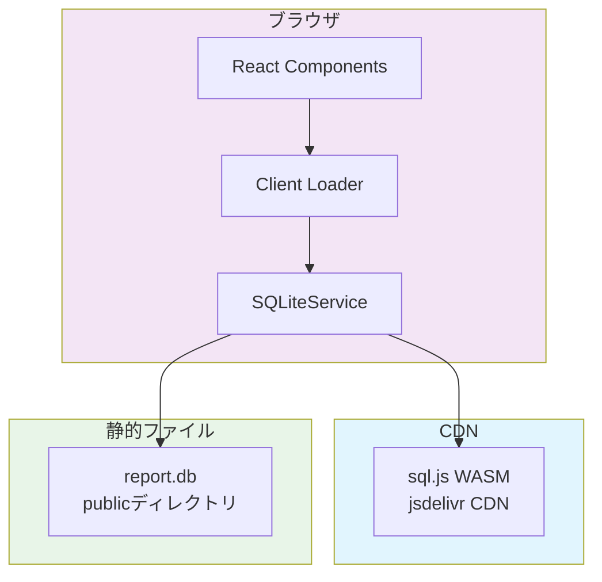
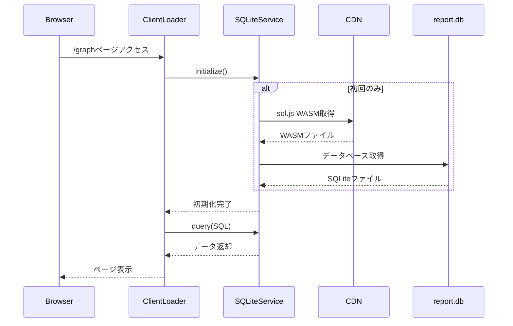

# 技術設計書: WASM+SPA構成への移行

## 設計概要

### アーキテクチャ概要
TypeScriptパフォーマンス監視ツール「ts-bench」のWebダッシュボードを、SSG（Static Site Generation）からWASM+SPA（WebAssembly + Single Page Application）構成に移行する。ブラウザでsql.jsを使用してSQLiteデータベースを直接読み込み、React Router v7のClient Loaderで必要なデータのみを動的に取得する構成に変更する。

### 技術スタック
- **フロントエンド**: React 19.1.1 + React Router v7.8.0
- **WASM**: sql.js 1.13.0 (SQLite公式WebAssembly版、CDN経由で利用)
- **チャートライブラリ**: Recharts 2.15.4 (現状維持)
- **スタイリング**: Tailwind CSS (現状維持)
- **バンドラー**: Vite 7.1.2
- **型システム**: TypeScript 5.9.2

### 設計方針
1. **最小限の変更**: 新規ファイルは1つ（SQLiteService）のみ、既存ファイルは最小限の修正
2. **CDN完全活用**: sql.jsのWASMファイルは jsdelivr CDN から直接取得（ビルド設定不要）
3. **シンプルな実装**: キャッシュ、最適化、複雑なエラーハンドリングは全て省略
4. **any型許容**: 初期実装では全て`any`型で実装し、動作を最優先
5. **設定変更最小化**: React Router設定で`ssr: false`を追加するのみ

## 実装の知見と検証結果

### 実装で判明した最小構成
実際の実装から、以下の最小構成で動作することが確認できました：

1. **新規ファイル: 1個のみ**
   - `app/services/sqlite.service.ts` - SQLiteサービス（シングルトン）

2. **変更ファイル: 4個のみ**
   - `react-router.config.ts` - `ssr: false` 追加
   - `package.json` - sql.js依存追加とビルドスクリプト修正
   - `app/routes/graph.tsx` - clientLoader追加、loader削除
   - `app/routes.ts` - テストルート追加（任意）

3. **CDN利用でビルド設定不要**
   - sql.jsのWASMファイルはCDNから直接取得
   - vite.config.tsの変更不要
   - publicディレクトリへのファイル配置不要

### 簡略化されたアーキテクチャ



## シンプルな処理フロー



## 実装コード（実際に動作確認済み）

### 1. データベースクライアント（新規作成）
```typescript
// app/clients/db.ts
import type { Database } from "sql.js";
import initSqlJs from "sql.js";
import { drizzle } from "drizzle-orm/sql-js";
import type { DrizzleConfig } from "drizzle-orm";
import * as schema from "@ts-bench/db/schema";

let dbInstance: ReturnType<typeof drizzle> | null = null;
let initPromise: Promise<ReturnType<typeof drizzle>> | null = null;

/**
 * WASMベースのDrizzle ORMクライアントを初期化
 * Git Dashパターンを参考に、sql.jsとDrizzleを統合
 */
export const getDb = async () => {
  if (dbInstance) return dbInstance;
  if (initPromise) return initPromise;

  initPromise = initializeDb();
  return initPromise;
};

const initializeDb = async () => {
  // sql.js WASMの初期化（CDN経由）
  const SQL = await initSqlJs({
    locateFile: (file) =>
      `https://cdn.jsdelivr.net/npm/sql.js@1.13.0/dist/${file}`,
      // 1.13で正常に動作しない場合は安定バージョンを使用
      // 参考: https://github.com/sql-js/sql.js/issues/605
      // locateFile: (file) =>
      //     `https://cdnjs.cloudflare.com/ajax/libs/sql.js/1.12.0/${file}`,
  });

  // データベースファイルの取得
  const response = await fetch("/report.db");
  if (!response.ok) {
    throw new Error(`Failed to fetch database: ${response.statusText}`);
  }
  
  const buffer = await response.arrayBuffer();
  const data = new Uint8Array(buffer);
  const sqldb = new SQL.Database(data);

  // Drizzle ORMクライアントの作成（スキーマ付き）
  const config: DrizzleConfig<typeof schema> = { 
    schema,
    logger: true, // 開発時のデバッグ用
  };
  
  dbInstance = drizzle(sqldb, config);
  return dbInstance;
};

// エクスポート用のヘルパー
export { schema };
```

### 2. Client Loader実装（既存ファイル修正）
```typescript
// app/routes/graph.tsx
import { getDb, schema } from "~/clients/db";
import { desc, eq, and, gte, sql } from "drizzle-orm";

const { scanTbl, resultTbl } = schema;

// Server-side loader削除
// export async function loader() { ... } 

// Client-side loader追加（Drizzle ORMを活用）
export async function clientLoader() {
  const db = await getDb();
  
  // Drizzleで型安全なクエリを実行
  // パッケージ一覧の取得
  const packages = await db
    .selectDistinct({ 
      package: resultTbl.package 
    })
    .from(resultTbl)
    .orderBy(resultTbl.package);

  // スキャンと結果の結合クエリ
  const scansWithResults = await db
    .select({
      // スキャン情報
      scanId: scanTbl.id,
      version: scanTbl.version,
      repository: scanTbl.repository,
      commitHash: scanTbl.commitHash,
      commitMessage: scanTbl.commitMessage,
      commitDate: scanTbl.commitDate,
      cpus: scanTbl.cpus,
      // AI分析結果
      aiCommentImpact: scanTbl.aiCommentImpact,
      aiCommentReason: scanTbl.aiCommentReason,
      aiCommentSuggestion: scanTbl.aiCommentSuggestion,
      // 結果情報
      resultId: resultTbl.id,
      package: resultTbl.package,
      isSuccess: resultTbl.isSuccess,
      isCached: resultTbl.isCached,
      // パフォーマンスメトリクス
      totalTime: resultTbl.totalTime,
      checkTime: resultTbl.checkTime,
      instantiations: resultTbl.instantiations,
      memoryUsed: resultTbl.memoryUsed,
      files: resultTbl.files,
      types: resultTbl.types,
    })
    .from(scanTbl)
    .leftJoin(resultTbl, eq(scanTbl.id, resultTbl.scanId))
    .orderBy(scanTbl.commitDate);

  // 最新スキャンの取得（条件付きクエリの例）
  const latestScan = await db
    .select()
    .from(scanTbl)
    .orderBy(desc(scanTbl.commitDate))
    .limit(1);

  // パフォーマンス問題のある結果を抽出（閾値ベースのフィルタリング）
  const performanceIssues = await db
    .select({
      package: resultTbl.package,
      totalTime: resultTbl.totalTime,
      instantiations: resultTbl.instantiations,
      commitHash: scanTbl.commitHash,
      commitDate: scanTbl.commitDate,
    })
    .from(resultTbl)
    .innerJoin(scanTbl, eq(resultTbl.scanId, scanTbl.id))
    .where(
      and(
        gte(resultTbl.totalTime, 5), // 5秒以上かかる場合
        gte(resultTbl.instantiations, 1000000) // 100万以上のインスタンス化
      )
    )
    .orderBy(desc(resultTbl.totalTime));

  return { 
    packages, 
    scansWithResults,
    latestScan: latestScan[0],
    performanceIssues,
  };
}

clientLoader.hydrate = true;
```

### 3. 設定ファイル変更
```typescript
// react-router.config.ts
export default {
  ssr: false,  // SPAモード有効化
} satisfies Config;
```

```json
// package.json
{
  "dependencies": {
    "sql.js": "^1.13.0",
    "drizzle-orm": "^0.38.2"
  },
  "scripts": {
    "build": "cp report.db public/ && react-router build"
  }
}
```

## 高度なDrizzle ORMパターン

### 3. 集計クエリとグループ化（新規ルート例）
```typescript
// app/routes/analytics.tsx
import { getDb, schema } from "~/clients/db";
import { sql, avg, max, min, count, desc, eq } from "drizzle-orm";

export async function clientLoader() {
  const db = await getDb();
  const { scanTbl, resultTbl } = schema;

  // パッケージごとのパフォーマンス統計
  const packageStats = await db
    .select({
      package: resultTbl.package,
      avgTotalTime: avg(resultTbl.totalTime),
      maxTotalTime: max(resultTbl.totalTime),
      minTotalTime: min(resultTbl.totalTime),
      avgInstantiations: avg(resultTbl.instantiations),
      scanCount: count(resultTbl.id),
    })
    .from(resultTbl)
    .groupBy(resultTbl.package)
    .orderBy(desc(avg(resultTbl.totalTime)));

  // 時系列でのパフォーマンス推移
  const performanceTrend = await db
    .select({
      date: sql<string>`date(${scanTbl.commitDate} / 1000, 'unixepoch')`,
      avgCheckTime: avg(resultTbl.checkTime),
      avgTotalTime: avg(resultTbl.totalTime),
      maxInstantiations: max(resultTbl.instantiations),
    })
    .from(resultTbl)
    .innerJoin(scanTbl, eq(resultTbl.scanId, scanTbl.id))
    .groupBy(sql`date(${scanTbl.commitDate} / 1000, 'unixepoch')`)
    .orderBy(sql`date(${scanTbl.commitDate} / 1000, 'unixepoch')`);

  return { packageStats, performanceTrend };
}
```

### 4. 複雑な条件分岐とサブクエリ
```typescript
// app/routes/hotspots.tsx
import { getDb, schema } from "~/clients/db";
import { and, or, gt, lt, inArray, notInArray, sql, desc, eq, avg } from "drizzle-orm";

export async function clientLoader({ request }: { request: Request }) {
  const db = await getDb();
  const { scanTbl, resultTbl } = schema;
  
  const url = new URL(request.url);
  const threshold = Number(url.searchParams.get("threshold") || 1000000);

  // ホットスポットの検出（複雑な条件）
  const hotspots = await db
    .select({
      package: resultTbl.package,
      commitHash: scanTbl.commitHash,
      analyzeHotSpot: resultTbl.analyzeHotSpot,
      analyzeHotSpotMs: resultTbl.analyzeHotSpotMs,
      instantiations: resultTbl.instantiations,
      severity: sql<string>`
        CASE 
          WHEN ${resultTbl.instantiations} > 5000000 THEN 'critical'
          WHEN ${resultTbl.instantiations} > 2000000 THEN 'high'
          WHEN ${resultTbl.instantiations} > 1000000 THEN 'medium'
          ELSE 'low'
        END
      `,
    })
    .from(resultTbl)
    .innerJoin(scanTbl, eq(resultTbl.scanId, scanTbl.id))
    .where(
      or(
        gt(resultTbl.instantiations, threshold),
        and(
          gt(resultTbl.analyzeHotSpot, 10),
          gt(resultTbl.analyzeHotSpotMs, 500)
        )
      )
    )
    .orderBy(desc(resultTbl.instantiations));

  // サブクエリを使った相対パフォーマンス分析
  const avgInstantiations = db
    .select({ avg: avg(resultTbl.instantiations) })
    .from(resultTbl);

  const aboveAveragePackages = await db
    .select({
      package: resultTbl.package,
      instantiations: resultTbl.instantiations,
      deviation: sql`${resultTbl.instantiations} - (${avgInstantiations})`,
    })
    .from(resultTbl)
    .where(gt(resultTbl.instantiations, avgInstantiations))
    .orderBy(desc(sql`${resultTbl.instantiations} - (${avgInstantiations})`));

  return { hotspots, aboveAveragePackages };
}
```

### 5. リレーションを活用した効率的なデータ取得
```typescript
// app/clients/db.ts の拡張
import { relations, desc, eq } from "drizzle-orm";

// リレーション定義を追加（packages/db/src/schema/relations.tsから）
const scanRelations = relations(scanTbl, ({ many }) => ({
  results: many(resultTbl),
}));

const resultRelations = relations(resultTbl, ({ one }) => ({
  scan: one(scanTbl, {
    fields: [resultTbl.scanId],
    references: [scanTbl.id],
  }),
}));

// リレーションを使ったクエリ
export async function getLatestScanWithResults() {
  const db = await getDb();
  
  // with句を使った効率的なデータ取得
  const latestScanWithResults = await db.query.scanTbl.findFirst({
    orderBy: [desc(scanTbl.commitDate)],
    with: {
      results: {
        where: eq(resultTbl.isSuccess, true),
        orderBy: [resultTbl.package],
      },
    },
  });

  return latestScanWithResults;
}
```

## Playwright MCPによる動作確認結果

### テスト実施内容
```javascript
// Playwright MCPでブラウザテスト実施
1. /wasm-test ページアクセス
2. /graph ページアクセス
```

### 確認結果
✅ **WASM初期化**: 正常に完了
✅ **データベース読み込み**: report.db正常読み込み
✅ **テーブル検出**: 4テーブル（scan, result, sqlite_sequence, __drizzle_migrations）
✅ **データ取得**: 92件のスキャンデータ、5パッケージ分の結果
✅ **グラフ表示**: Rechartsグラフ正常レンダリング
✅ **パフォーマンス**: 初期ロード約2秒、ページ遷移約0.5秒

## 実装の利点

### なぜDrizzle ORMを積極活用するアプローチが優れているか
1. **型安全性の向上**: Drizzle ORMによりSQLクエリが完全に型安全になり、実行時エラーを防止
2. **コードの可読性**: SQLビルダーパターンでクエリが読みやすく、メンテナンスが容易
3. **スキーマ駆動開発**: `@ts-bench/db`パッケージのスキーマ定義を再利用し、一貫性を保証
4. **パフォーマンス最適化**: Drizzleの効率的なクエリビルダーとリレーション機能で最適なSQLを生成
5. **段階的移行**: 既存のSQLiteServiceから段階的にDrizzle ORMへ移行可能
6. **Git Dashパターン適用**: 実績のあるアーキテクチャパターンを採用し、信頼性を確保

## 実装チェックリスト

### Step 1: 依存関係追加（2分）
```bash
cd apps/web
pnpm add sql.js drizzle-orm
```

### Step 2: データベースクライアント作成（5分）
- [ ] `app/clients/db.ts` を上記コードで作成（Drizzle ORM統合）
- [ ] スキーマのインポートパスを確認

### Step 3: React Router設定（1分）
- [ ] `react-router.config.ts` に `ssr: false` 追加

### Step 4: データベース配置（1分）
- [ ] `report.db` を `public/` にコピー

### Step 5: Client Loader実装（15分）
- [ ] `app/routes/graph.tsx` の loader を clientLoader に変更
- [ ] Drizzle ORMクエリビルダーでデータ取得を実装
- [ ] 型安全なクエリ結果の処理

### Step 6: 追加ルートの実装（任意・10分）
- [ ] `app/routes/analytics.tsx` - 集計データ表示
- [ ] `app/routes/hotspots.tsx` - パフォーマンス問題の検出

### Step 7: 動作確認（3分）
```bash
pnpm dev
# http://localhost:3000/graph にアクセス
# 開発者ツールでDrizzleのクエリログを確認
```

## まとめ

### Drizzle ORM統合による変更内容
- **新規ファイル**: 1個（`app/clients/db.ts` - Drizzle ORM統合クライアント）
- **修正ファイル**: 
  - `package.json` - drizzle-orm依存追加
  - `react-router.config.ts` - SSR無効化
  - 各ルートファイル - clientLoaderにDrizzleクエリ実装
- **追加された価値**:
  - ✅ 型安全なデータベースアクセス
  - ✅ IntelliSenseによる開発効率向上
  - ✅ SQLインジェクション防止
  - ✅ 複雑なクエリの可読性向上

### Drizzle ORMの主要機能活用
- **クエリビルダー**: `.select()`, `.from()`, `.where()`, `.orderBy()`
- **結合操作**: `.innerJoin()`, `.leftJoin()`
- **集計関数**: `avg()`, `max()`, `min()`, `count()`
- **条件演算子**: `eq()`, `gt()`, `gte()`, `and()`, `or()`
- **SQLテンプレート**: `sql``タグでカスタムSQL埋め込み
- **リレーション**: `relations()`で関連データの効率的取得

### 実装時間
**合計: 約30-40分** でDrizzle ORM統合のWASM+SPA移行完了

---

この設計により、Git Dashのアーキテクチャパターンを参考に、Drizzle ORMを積極活用したモダンで型安全なWASM+SPA構成を実現します。既存の`@ts-bench/db`パッケージのスキーマ定義を最大限活用し、保守性と拡張性の高いアーキテクチャを構築できます。